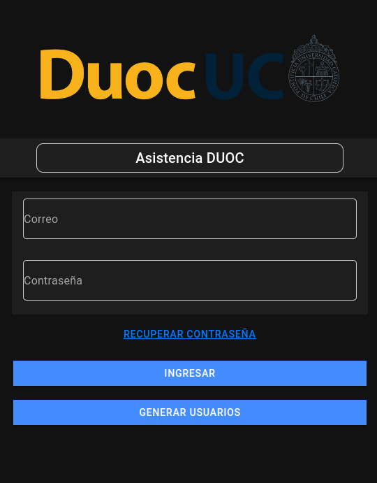

# Proyecto-ionic-duoc

#### Este es un proyecto desarrollado con el framework Ionic. A continuación, se detallan los pasos necesarios para configurar, ejecutar y solucionar problemas comunes en el proyecto.




## Requisitos

#### Asegúrate de tener instaladas las siguientes herramientas en tu sistema antes de proceder:

* Node.js: Puedes descargarlo desde Node.js.

* Ionic CLI: Instala Ionic CLI ejecutando el siguiente comando:

``` 
npm install -g @ionic/cli
```

## Instalación

Una vez que tengas instaladas las dependencias mencionadas, puedes clonar este repositorio y proceder con la instalación de los paquetes necesarios.

### Clona el repositorio

```
git clone https://github.com/proyecto-ionic-duoc/Proyecto-ionic-duoc
```

```
cd Proyecto-ionic-duoc
```

### Instala las dependencias

Puedes instalar las dependencias del proyecto utilizando npm o pnpm. El proyecto ha sido testeado solo con pnpm versión 9.7.1.

* Con npm:
```
npm install
```

* Con pnpm:
```
pnpm install
```
## Ejecución del proyecto

Para levantar el servidor de desarrollo y visualizar la aplicación, ejecuta el siguiente comando:
```
ionic serve
```
Este comando abrirá la aplicación en tu navegador predeterminado, y cualquier cambio que realices en el código se reflejará en tiempo real.

### Solución de problemas

Problema de compilación con TypeScript

##### Si ves un error similar a:

```
Error: Failed to initialize Angular compilation - The Angular Compiler requires TypeScript >=4.9.3 and <5.2.0 but 5.6.2 was found instead.
```
#### Solución:

##### Instala una versión de TypeScript compatible con Angular:
Con npm: 
```
npm install typescript@~5.1.0 --save-dev
```

Con pnpm: 
```
pnpm install typescript@~5.1.0 --save-dev
```

Verifica la versión de TypeScript: 
```
npx tsc -v
```


### * Advertencia sobre el módulo 'crypto'

##### Si ves advertencias como:
```
Warning: Module not found: Error: Can't resolve 'crypto'
```

#### Solución:

Si necesitas el módulo crypto en el navegador, instala crypto-browserify y agrega el polyfill en tu configuración de Webpack:

#### Instala crypto-browserify:

Con npm: 
```
npm install crypto-browserify --save
```
Con pnpm: 
```
pnpm install crypto-browserify --save
```


## Nota: El proyecto fue testeado utilizando pnpm versión 9.7.1. Asegúrate de tener la versión adecuada de pnpm si decides utilizar este gestor de paquetes.